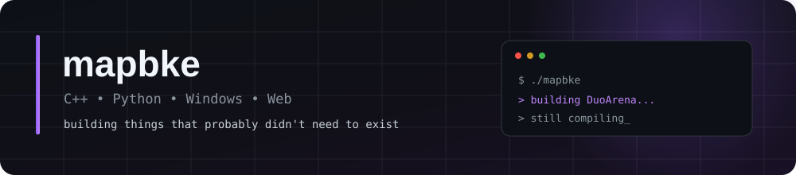
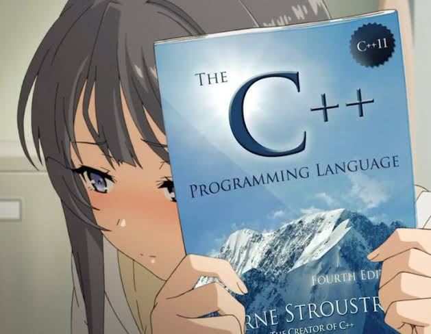

  

  

  

  <code>C++</code>
  <code>Python</code>
  <code>JavaScript</code>
  <code>TypeScript</code>
  <code>Rust</code>
  <code>WinAPI</code>

 

## `~/projects`

<table>
<tr>

<td width="33%" valign="top">

### ⚔️ DuoArena

Private realtime arena for two players.

`Python` `Flask`  
`Socket.IO` `SQLite`

**status:** `building`

</td>

<td width="33%" valign="top">

### ⚙️ OptiBN

Windows and game optimization desktop app.

`Rust` `Tauri`  
`React` `Windows`

**status:** `in development`

</td>

<td width="33%" valign="top">

### ◈ SPECTRE.WIN

Experimental Windows desktop interface.

`C++20` `ImGui`  
`DX11` `Win32`

**status:** `experimental`

</td>

</tr>
</table>

 

## `~/stack`

  

 

## `~/contributions`

<picture>
  <source
    media="(prefers-color-scheme: dark)"
    srcset="https://raw.githubusercontent.com/mapbke/mapbke/output/github-contribution-grid-snake-dark.svg"
  >
  <source
    media="(prefers-color-scheme: light)"
    srcset="https://raw.githubusercontent.com/mapbke/mapbke/output/github-contribution-grid-snake.svg"
  >
  
</picture>

 

  
    <code>while (alive) { build(); break_things(); fix_things(); }</code>
  

